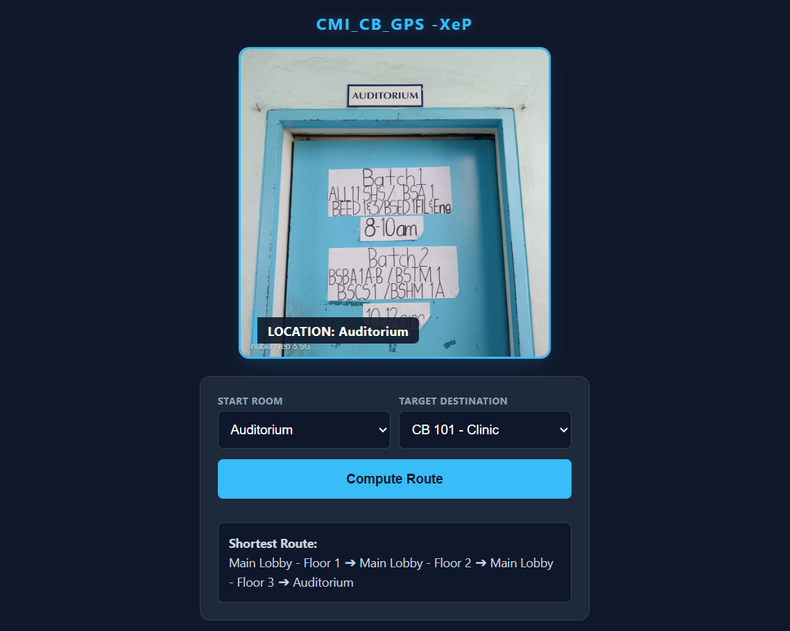
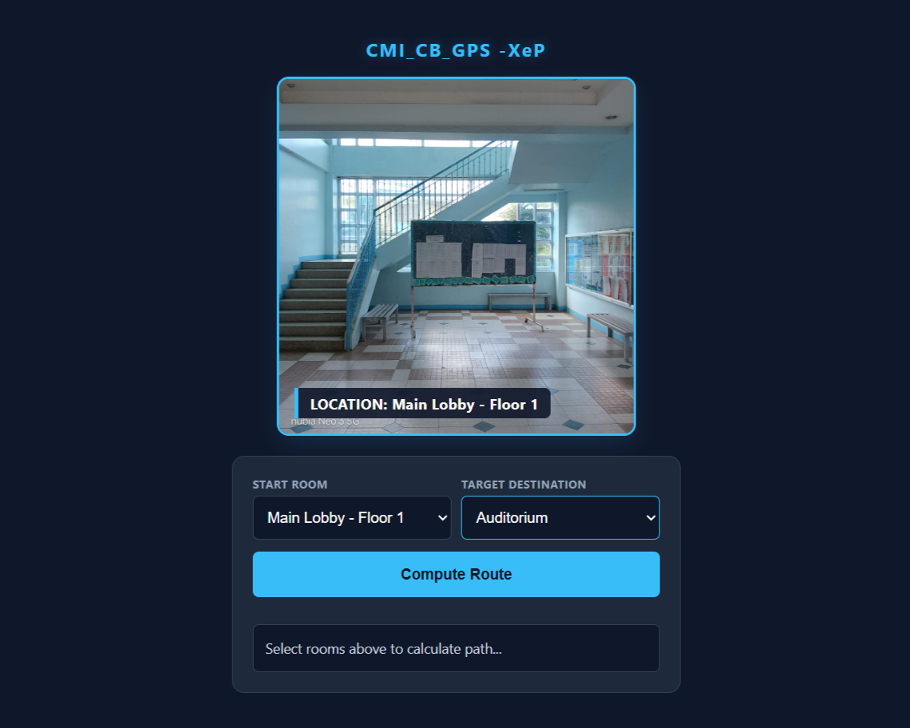

# 🗺️ CMI_CB_GPS -XeP 

An interactive, mobile-responsive campus indoor navigation system. It calculates the shortest path between classrooms across multiple floors using a **Breadth-First Search (BFS)** graph algorithm and provides synchronized, visual step-by-step guidance.

---

## ✨ Features

*   🧠 **Smart Routing:** Uses a custom BFS graph algorithm to instantly find the absolute shortest path between two points.
*   📸 **Visual Wayfinding:** Dynamically loads direction-specific images (`Up`, `Down`, `Left`, `Right`, `Forward`, `Backward`) for every node transition.
*   🔄 **Dynamic Dropdowns:** Automatically filters the destination list so users cannot pick their current starting room. 
*   📱 **Mobile-First Design:** Fully responsive picture-box view container tailored for smartphones.
*   ⏱️ **Animated Walkthrough:** Simulates the route in real-time with an active tracking trail and a text-based breadcrumb output.

---

## 🚀 How It Works (Code Architecture)

[ UI Dropdowns ] ➔ [ BFS Algorithm ] ➔ [ 1-Second Step Timer ] ➔ [ Dynamic Image Loader ]


1. **Graph Setup (`graph.json`):** The campus layout is mapped out as an interconnected network of nodes (rooms, hallways, stairs).
2. **Path Finding:** When clicking **Compute Route**, the engine pulls the graph structure and runs the BFS solver to determine the precise sequence of movements.
3. **Visual Syncing:** The system loops through the generated instructions, matching action codes (`u`, `d`, `l`, `r`, `f`, `b`) to actual image directories (`../School-GPS/{roomKey}/{action}.jpeg`).

---

## 📱 Live Interaction Demo


### 📍 Example Route: [Insert Start Room] ➔ [Insert Target Room]

#### **Step 1: Selection (Ready State)**
> *The user selects their start point and final destination from the dropdown list.*


#### **Step 2: Transition (In-Progress State)**
> *The application runs through the steps, displaying a 1-second dynamic transition frame for each point along the way.*


#### **Step 3: Arrival (Destination State)**
> *The sequence completes and highlights the final location room banner.*


---

## 🛠️ Data Structure Sample

The application expects a `graph.json` in the same working directory. Here is an example layout mapping how rooms connect to each other:

```json
{
  "main": [
    { "next": "main1", "action": "f" }
  ],
  "main1": [
    { "next": "main", "action": "b" },
    { "next": "104", "action": "l" },
    { "next": "stair1-l", "action": "f" }
  ],
  "104": [
    { "next": "main1", "action": "r" }
  ]
}

💻 Tech Stack
HTML5 & CSS3: Semantically structured blocks with a clean modern overlay UI.

Vanilla JavaScript (ES6+): Asynchronous route resolution using Promises and native fetch tools.

Data Models: Graph network objects stored natively in JSON.